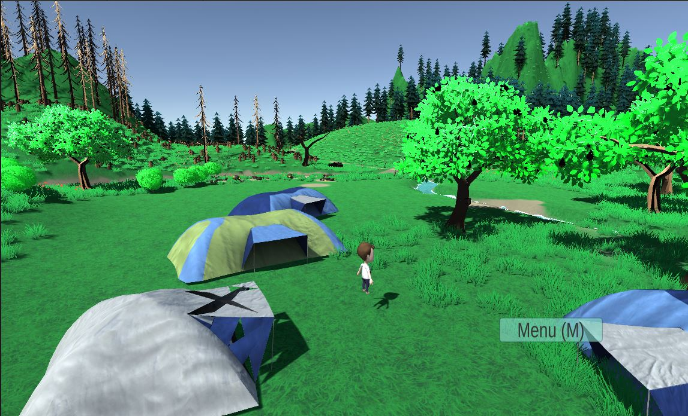

# ClimateCampAdventures
## A Simulator for Climate Activists that is both fun and can prepare you for action
This project was part of the Introduction to Unity course. Our first project working with Unity and C#. In the final game you can experience some of the problems you might face when going to a climate camp. In our chosen scenario the player finds herself in a base camp with the final goal to find the coal mine and stop the diggers, while encountering some further tasks on the way. An extension to the game might likely happen in the future

  

## To get a sneak peek into the game you can watch our gameplay video

## Assets and music that have been used in the game
Assets:\n
https://assetstore.unity.com/packages/3d/chainlink-fences-73107
https://assetstore.unity.com/packages/3d/props/exterior/tents-21461
https://assetstore.unity.com/packages/3d/environments/lowpoly-environment-nature-pack-free-187052
https://assetstore.unity.com/packages/3d/vehicles/land/polygrunt-construction-vehicles-168884
https://assetstore.unity.com/packages/tools/particles-effects/lowpoly-water-107563
https://assetstore.unity.com/packages/3d/characters/humanoids/character-pack-free-sample-79870

Music:/n
Foam Rubber by Alexander Nakarada | https://www.serpentsoundstudios.com
Music promoted on https://www.chosic.com/free-music/all/
Creative Commons Attribution 4.0 International (CC BY 4.0)
https://creativecommons.org/licenses/by/4.0/
